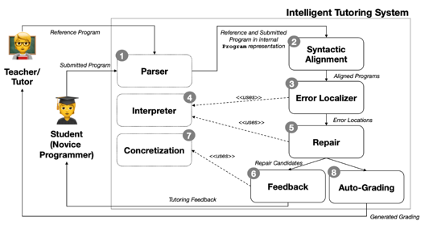
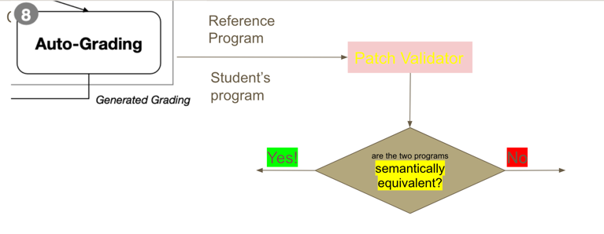
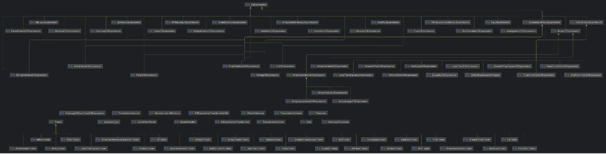
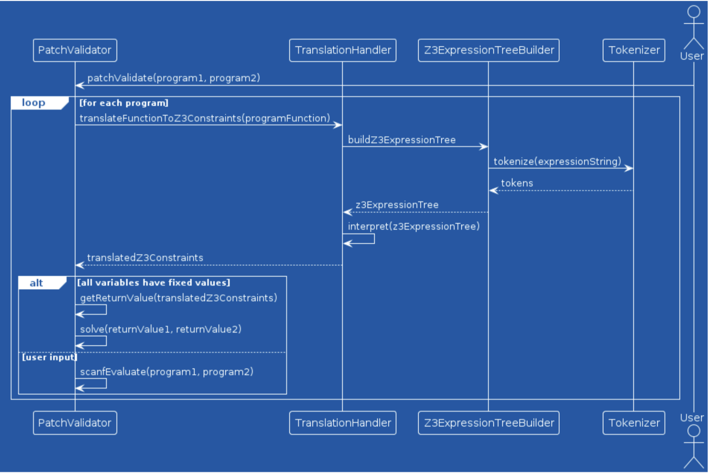

# Patch Validator for Intelligent Tutoring System (ITS)

## Overview
The Patch Validator is a core component of an Intelligent Tutoring System (ITS) designed to automatically evaluate student code submissions. Instead of relying on simple syntax or test-case matching, this system ensures that a student's patched submission is semantically equivalent to a reference solution.

Semantic equivalence means that two programs produce the same results for any given input, even if their internal logic differs. Our validator supports both pure functions (where return values determine correctness) and impure functions (which involve side effects such as print statements).

## How it fits into the Intelligent Tutoring System

## Why It Matters:
This system enhances automated grading by allowing for flexible code solutions, ensuring fairness while reducing manual effort in coding assignments and programming competitions.

## Features
- Semantic Equivalence Verification: Compares patched and reference programs to determine whether they produce identical outputs and return values.
- Support for Impure Functions: Handles functions with side effects, ensuring equivalence based on outputs instead of just return values.
- Integration with ITS Modules: Uses ITS components such as the parser and structural aligner for program pre-processing before validation.
- Z3 Solver Integration: Translates programs into Z3 logical formulas for precise semantic analysis.
- Support for Basic Input/Output Operations: Implements basic scanf and printf functions for equivalence checking with user inputs.

## How It Works
1. Input Parsing and Structural Alignment: The patched and reference programs are parsed by the ITS parser and aligned using the ITS structural aligner.
2. Z3 Translation: Both programs are translated into Z3 logical formulas.
3. Z3 Solver: The Z3 solver processes the formulas to determine whether the two programs are semantically equivalent.
4. Output Comparison: The program evaluates the return values and output from both programs and determines equivalence.

## Documentation
### Class Diagram

### Sequence Diagram

